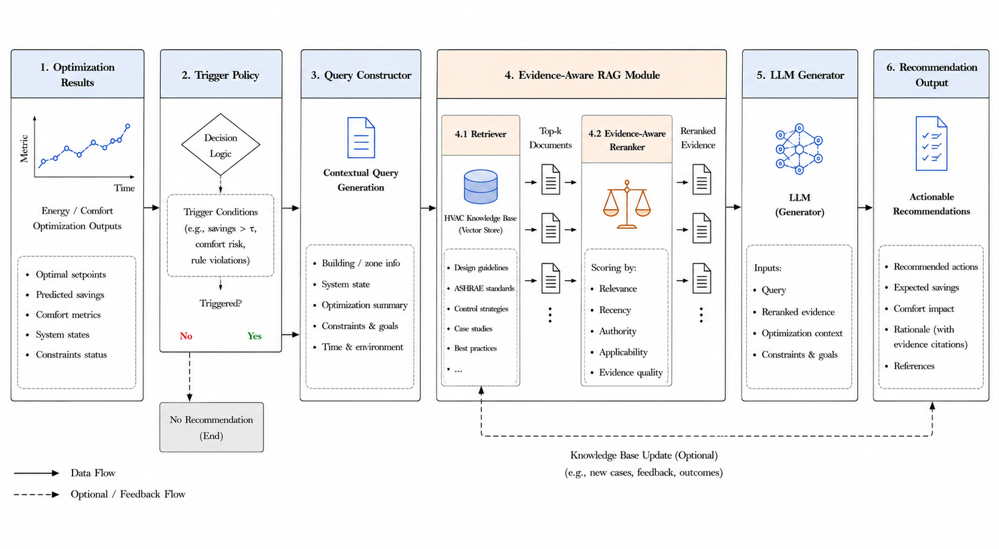

# Evidence-Aware RAG-LLM HVAC Recommendation Module

A lightweight public release of the **LLM-based recommendation generation module** for HVAC energy-saving suggestions.

This repository focuses only on the **recommendation generation component** and excludes the full energy prediction and optimization training system.

---

## Architecture Overview



> Fig. 1. Overall architecture of the proposed evidence-aware RAG-LLM recommendation system for HVAC energy saving.

The system consists of six sequential modules:

1. **Optimization Results** — receives energy/comfort optimization outputs (optimal setpoints, predicted savings, comfort metrics, system states, constraints status)
2. **Trigger Policy** — decision logic that determines whether a recommendation is needed based on trigger conditions (e.g., savings > τ, comfort risk, rule violations)
3. **Query Constructor** — generates a contextual query from building/zone info, system state, optimization summary, constraints & goals, and time & environment
4. **Evidence-Aware RAG Module** — retrieves Top-k documents from the HVAC Knowledge Base and reranks them by Relevance, Recency, Authority, Applicability, and Evidence quality
5. **LLM Generator** — generates recommendations using the query, reranked evidence, optimization context, and constraints & goals
6. **Recommendation Output** — produces actionable recommendations including recommended actions, expected savings, comfort impact, rationale with evidence citations, and references

---

## Related Repositories

This module is the **third and final stage** of the BI-TECH energy management pipeline. It depends on the outputs of the following two upstream repositories:

### Stage 1 — RL-LSTM Energy Prediction
> **[wxy0111/RL-LSTM-office-energy-prediction](https://github.com/wxy0111/RL-LSTM-office-energy-prediction)**

A Bidirectional LSTM model enhanced with a DDPG-based reinforcement learning agent for real-time adaptive energy consumption prediction. This module produces the energy forecasts used by the optimization stage.

- Input: Environmental sensor data (temperature, humidity, CO₂, illuminance, globe temperature, power)
- Output: Predicted energy consumption per timestep (`lstm_model.pth`, `rl_actor.pth`, etc.)
- Key results: CVRMSE improved by **23.3%**, MAPE reduced by **25.2%**

### Stage 2 — Heuristic Optimization
> **[wxy0111/Heuristic-optimization-office-energy](https://github.com/wxy0111/Heuristic-optimization-office-energy)**

A multi-objective heuristic framework that uses the RL-LSTM predictions to determine optimal indoor temperature setpoints, balancing energy efficiency, thermal comfort (PMV), and behavioral adaptability.

- Input: Pre-trained RL-LSTM model + real-time environmental data
- Output: Optimal temperature setpoints + predicted savings per timestep
- Key results: **12.87%** energy savings during working hours

### Stage 3 — This Repository (RAG-LLM Recommendation)

Takes the optimization results from Stage 2 as input and generates actionable, evidence-backed natural language energy-saving recommendations using a RAG-enhanced LLM pipeline.

- Input: Optimization results (optimal setpoints, predicted savings, comfort metrics, system states)
- Output: Actionable recommendations with expected savings, comfort impact, rationale, and references

---

## Full Pipeline

```
[Stage 1] RL-LSTM Energy Prediction
    │
    │  Predicted energy consumption per timestep
    ▼
[Stage 2] Heuristic Optimization
    │
    │  Optimal setpoints + predicted savings + comfort metrics
    ▼
[Stage 3] Evidence-Aware RAG-LLM Recommendation  ← This Repository
    │
    │  Actionable natural language recommendations
    ▼
     User / Building Management System
```

---

## Highlights

- Rule-constrained action interpretation
- Multi-source evidence retrieval
- Historical case retrieval and user feedback retrieval
- User preference profiling
- Two-stage LLM generation
- Validation and auto-repair
- Lightweight public dataset examples

---

## What is included

This repository includes the public-facing recommendation generation pipeline:

1. **Action Construction**
2. **Evidence Retrieval**
3. **Evidence Selection and Summarization**
4. **Two-Stage LLM Generation**
5. **Validation and Repair**

This repository does **not** include:
- LSTM / RL training pipeline
- Full building energy prediction models
- Private deployment assets
- Full internal experimental environment

---

## Method Overview

The recommendation module follows a rule-constrained and evidence-aware pipeline:

- A fixed candidate action plan is first constructed
- Relevant evidence is retrieved from:
  - rule knowledge base
  - historical optimization cases
  - user feedback memory
- Retrieved evidence is filtered and summarized
- A compact user preference profile is built
- The LLM then generates the recommendation in **two stages**:
  - **Planning stage**: generate structured JSON clauses
  - **Realization stage**: compose final natural-language recommendation text
- The generated output is validated and automatically repaired when necessary

This design separates **action planning** from **language realization**.
The LLM does not directly decide the HVAC control action.

---

## Repository Structure

```bash
.
├── README.md
├── LICENSE
├── requirements.txt
├── src/
│   ├── demo_runner.py
│   └── recommendation/
│       ├── __init__.py
│       ├── paths.py
│       ├── action_constructor.py
│       ├── action_schema.py
│       ├── evaluate.py
│       ├── evidence.py
│       ├── evidence_pipeline.py
│       ├── feedback_retriever.py
│       ├── generator.py
│       ├── history_retriever.py
│       ├── policy.py
│       ├── rag_retriever.py
│       ├── retriever.py
│       ├── user_feedback_store.py
│       ├── user_profile.py
│       └── validator.py
├── data/
│   ├── knowledge/
│   │   └── recommendation_knowledge_base.json
│   ├── feedback/
│   │   └── user_feedback_examples.csv
│   ├── history/
│   │   └── optimization_results_sample.csv
│   └── examples/
│       └── recommendation_evidence_aware_rag_llm_sample.csv
├── docs/
│   ├── figures/
│   │   └── architecture_overview.png
│   ├── method_overview.md
│   ├── dataset_description.md
│   └── reproducibility.md
└── outputs/
```

---

## Datasets Included

### Rule Knowledge Base
`data/knowledge/recommendation_knowledge_base.json`

A structured knowledge base containing recommendation-support rules such as:
- ventilation rules
- window opening constraints
- comfort-energy tradeoff guidance
- gradual adjustment principles

### Historical Cases
`data/history/optimization_results_sample.csv`

Sample historical optimization cases used for retrieval-augmented recommendation generation.

### User Feedback Memory
`data/feedback/user_feedback_examples.csv`

Sample user feedback records used for preference retrieval and user profile construction.

### Example Output
`data/examples/recommendation_evidence_aware_rag_llm_sample.csv`

Example generated recommendations and metadata fields.

---

## Installation

```bash
pip install -r requirements.txt
```

---

## Quick Start

Set your OpenAI API key:

```bash
export OPENAI_API_KEY=your_key_here
```

Run the demo from the repository root:

```bash
PYTHONPATH=src python src/demo_runner.py
```

---

## Documentation

See:
- `docs/method_overview.md`
- `docs/dataset_description.md`
- `docs/reproducibility.md`

---

## Intended Use

This repository is designed for:
- paper reproducibility of the recommendation generation module
- method illustration for evidence-aware HVAC recommendation generation
- public release of the LLM-based recommendation component only

---

## Citation

If you use this repository in academic work, please cite the associated paper.
